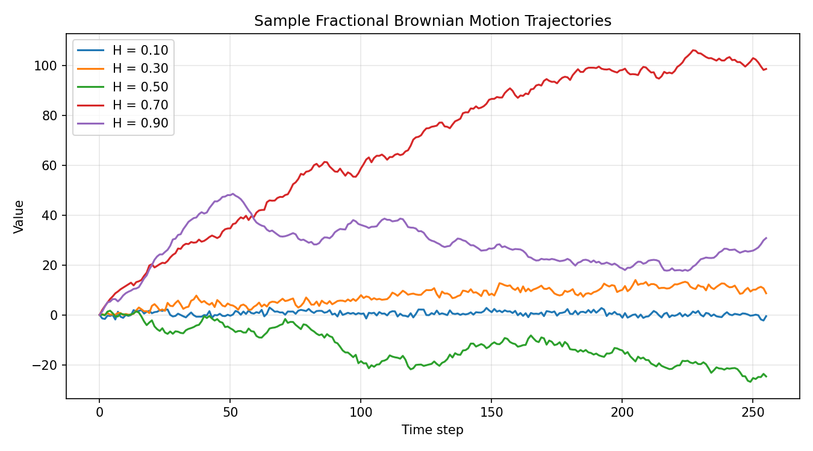
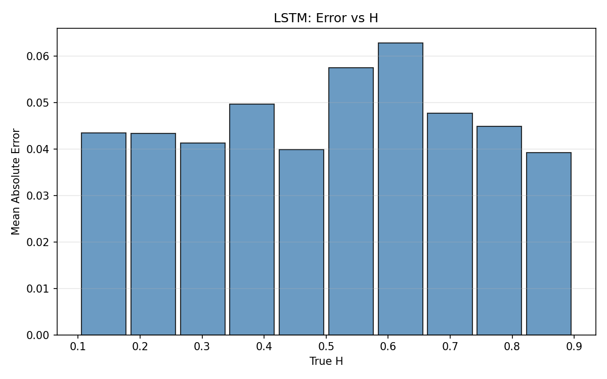
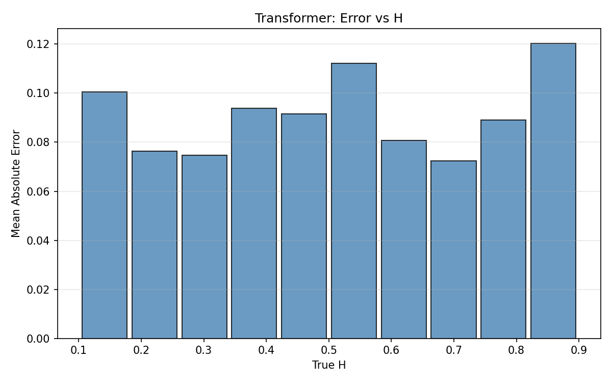
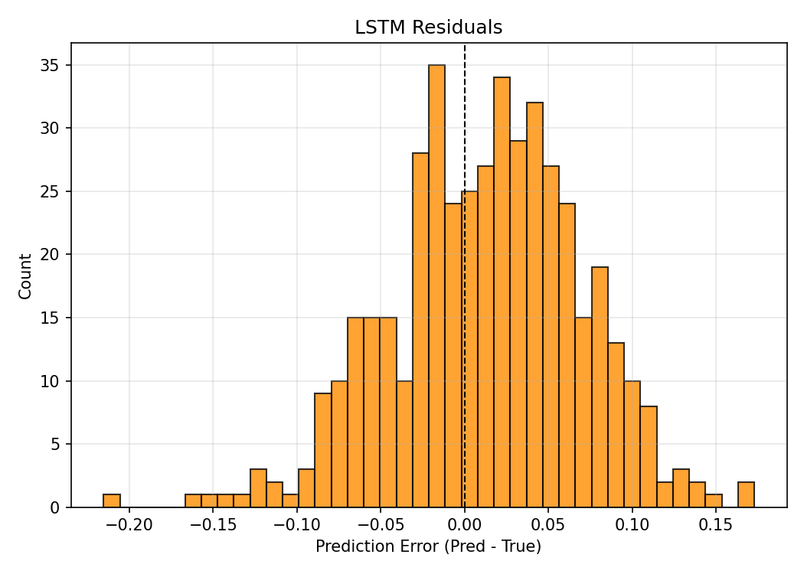
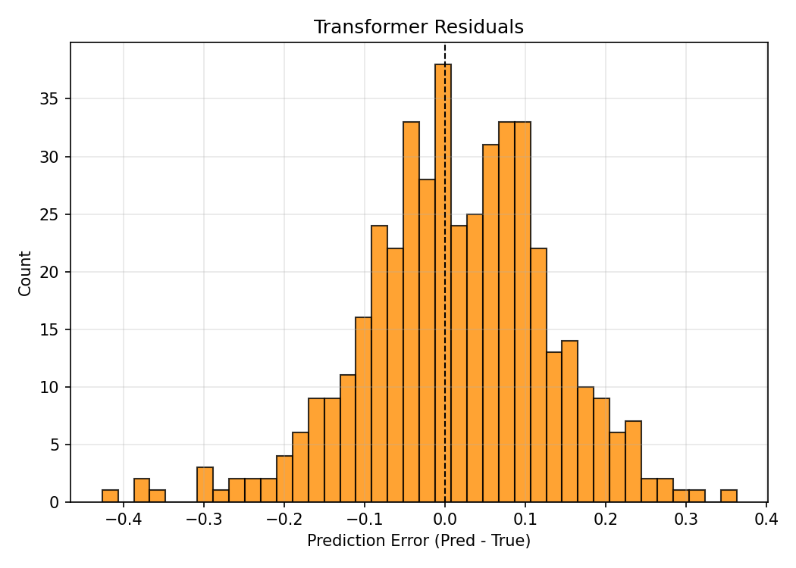
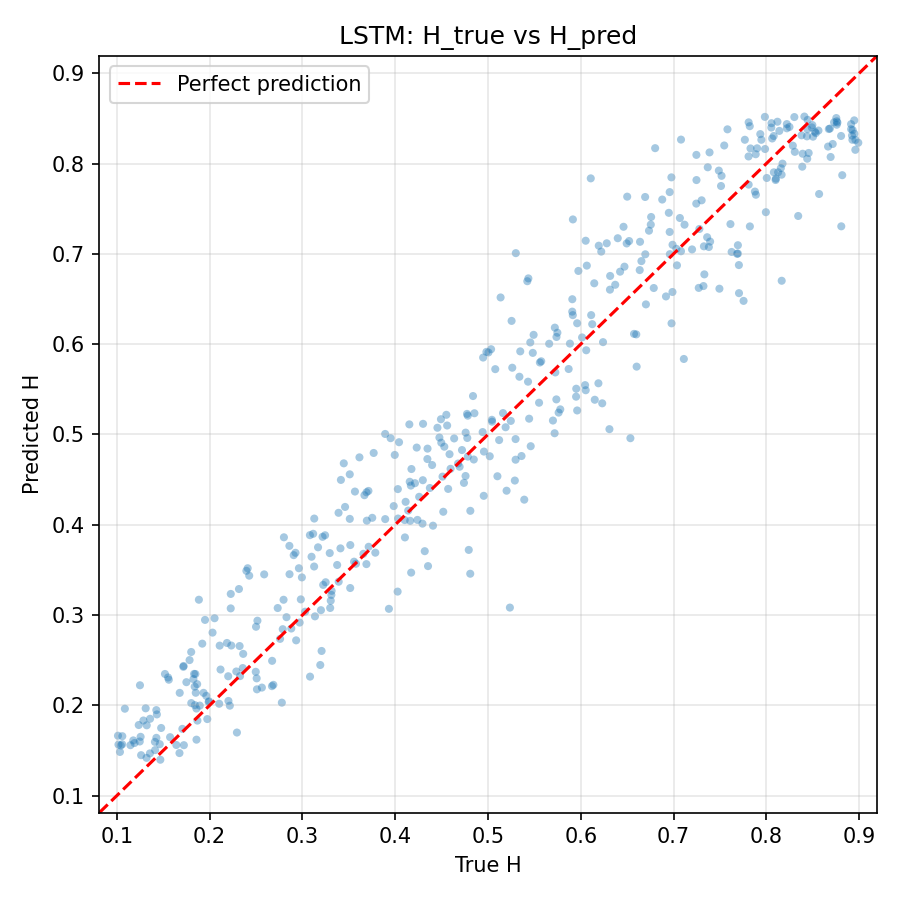
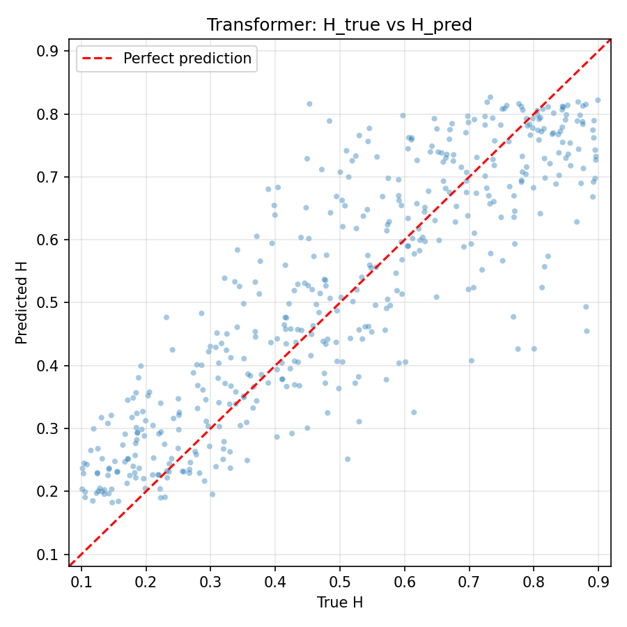

# Anomalous Hurst Coefficient Prediction using Sequence Models

A deep learning framework for estimating the **Hurst exponent (H)** of **Fractional Brownian Motion (fBm)** trajectories using both classical machine learning and modern sequence models.

The project provides:

- Simulation methods of fractional Brownian motion (fBm)
- Feature-based baseline models
- Bidirectional LSTM regressor
- Transformer-based regressor
- Complete training and evaluation pipeline
- Visualization utilities for prediction analysis
---


# Background

Fractional Brownian Motion is a centered Gaussian process

\[
B_H(t)
\]

with covariance

\[
\text{Cov}(B_H(t),B_H(s))
=
\frac12
\left(
|t|^{2H}
+
|s|^{2H}
-
|t-s|^{2H}
\right)
\]

where

\[
H \in (0,1)
\]

is the Hurst exponent.

Unlike standard Brownian motion, fBm exhibits correlated increments.

| Hurst Exponent | Behavior |
|---------------|----------|
| H < 0.5 | Anti-persistent |
| H = 0.5 | Brownian Motion |
| H > 0.5 | Persistent / Long-memory |

The objective of this project is to learn a mapping

\[
\text{Trajectory} \rightarrow H
\]

using simulated fBm data.

---

# Fractional Gaussian Noise

The increment process

\[
X_k = B_H(k)-B_H(k-1)
\]

is called **Fractional Gaussian Noise (fGn)**.

Unlike fBm, fGn is stationary and is completely characterized by its autocovariance

\[
\gamma(k)
=
\frac12
(
|k-1|^{2H}
-
2|k|^{2H}
+
|k+1|^{2H}
)
\]

All simulation algorithms generate fGn first and recover fBm using the cumulative sum.

---

# Simulation Methods

## 1. Davies–Harte

- FFT-based exact simulator
- Complexity: $O(T log T)$

Advantages:

- Extremely fast
- Low memory usage
- Default generator here
---

## 2. Hosking

Recursive conditional simulation using the Durbin–Levinson recursion.

Complexity: (Time: $O(T²)$), (Memory: $O(T)$)

Advantages
- Numerically stable
- Works for every H

---

## 3. Cholesky

Constructs the covariance matrix explicitly and performs Cholesky decomposition.

Complexity: Time: $O(T³)$, Memory: $O(T²)$

---


### Features
Extracts 13 statistical features from each trajectory.

- Increment variance 
- Mean absolute increment
- R/S log-log slope
- Increment autocorrelation (lags 1–10)

The models also include:

- Linear Regression
- Random Forest Regressor (default)
---

# Deep Learning Models

## 1.  Bidirectional LSTM

Characteristics

- Bidirectional
- Hidden size = 128
- 2 LSTM layers
- Dropout = 0.2

The sigmoid output guarantees predictions remain in the valid interval
```
0 < H < 1
```

---

## Transformer

Default configuration

- d_model = 64
- 3 encoder layers
- 4 attention heads
- GELU activation

The Transformer is particularly effective for learning long-range dependencies present in persistent fBm trajectories.

---

# Training

Training is shared between both deep models.

Configuration

- Loss: Mean Squared Error (MSE)
- Optimizer: Adam
- Learning rate: 1e-3
- Weight decay: 1e-5
- Batch size: 64
- Early stopping
- Automatic CUDA support

The best-performing model (lowest validation loss) is automatically restored after training.

---

# Evaluation

- Mean Absolute Error (MAE)
- Root Mean Squared Error (RMSE)
- R² Score

---

# Visualizations

The evaluation module includes

- Sample trajectories
- Training and validation loss curves
- Prediction vs Ground Truth scatter plots
- Error vs Hurst coefficient
- Residual histogram

---

# Running the Project

Install dependencies

```bash
pip install -r requirements.txt
```

Run the full pipeline

```bash
python main.py
```

Example

```bash
python main.py \
    --n_samples 10000 \
    --T 512 \
    --epochs 100 \
    --batch_size 64 \
    --lr 1e-3 \
    --seed 42 \
    --outdir results
```

---

# Analysis
<p align="center">
  
</p>

> **Explanation:** For small values of the Hurst exponent H, successive increments are negatively correlated (anti-persistent), causing the motion to frequently reverse direction and suppress the overall displacement. In contrast, for large values of H, successive increments are positively correlated, resulting in persistent motion with longer runs in the same direction and larger overall displacement. 


<p align="center">
  
  
</p>

> The prediction error remains approximately uniform across the entire range of Hurst exponents, indicating that neither model exhibits a systematic bias toward a particular diffusion regime (anti-persistent, Brownian, or persistent motion).

<p align="center">
  
  
</p>

> The residual histogram of the LSTM is shifted slightly toward positive values, suggesting a tendency to overestimate the Hurst exponent. In contrast, the Transformer's residual distribution is approximately symmetric and centered around zero, indicating little to no systematic prediction bias.

<p align="center">
  
  
</p>

> The scatter plots show that the LSTM achieves predictions that are more closely aligned with the ground truth, whereas the Transformer produces a larger spread around the identity line, indicating comparatively poorer regression performance.

# Limitations

- Fixed sequence length during training
- Uniform sampling of H
- Predicts only point estimates
- No uncertainty estimation
- Synthetic data only
- No physics-informed regularization

---

# Future Work

Potential improvements are as follows.

- Bayesian or probabilistic Hurst estimation
- Physics-informed loss functions (??)
- Real-world financial and experimental dataset.
- Variable-length sequence
- Efficient Transformer variants for longer trajectories
- Distributional prediction using Beta regression
- Can this model identify continuous-time random walk (CTRW), fractional Brownian motion (FBM), Lévy walk, scaled Brownian motion (SBM), annealed transient time motion (ATTM) (As done in ref. [6])
- Go through refs.[6-9]

---

# References


1. Mandelbrot, B. B., & Van Ness, J. W. (1968). *Fractional Brownian Motions, Fractional Noises and Applications.*
1. Hurst, H. E. (1951). *Long-term Storage Capacity of Reservoirs.*
1. Davies, R. B., & Harte, D. S. (1987). *Tests for Hurst Effect.*
1. Hosking, J. R. M. (1984). *Modeling Persistence in Hydrological Time Series.*
1. Vaswani, A., et al. (2017). *Attention Is All You Need.*

1. Seckler, H., Metzler, R. Bayesian deep learning for error estimation in the analysis of anomalous diffusion. Nat Commun 13, 6717 (2022). https://doi.org/10.1038/s41467-022-34305-6

1. Wang, G., Zhang, Y., & Huang, Z. (2026). Data-efficient learning of anomalous diffusion with wavelet representations: Enabling direct learning from experimental trajectories. Physical Review Research, 8(2). doi:10.1103/sx22-92gh


1. Lavrynenko, R., Kirichenko, L., Yakovlev, S., Lavrynenko, S., & Ryabova, N. (2025). Ensemble-based correction for anomalous diffusion exponent estimation in single-particle tracking. Applied Sciences (Basel, Switzerland), 15(14), 8000. doi:10.3390/app15148000

1. Cai, W., Hu, Y., Qu, X., Zhao, H., Wang, G., Li, J., & Huang, Z. (2024). Machine learning analysis of anomalous diffusion. doi:10.48550/arXiv.2412.01393